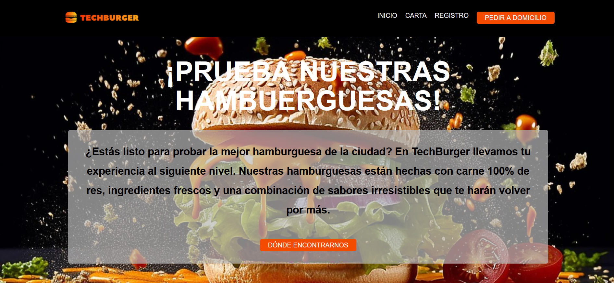

# Techburger. Diseño de una página web desde Figma
Proyecto hamburguesería Techburger hecho con html, sass y vite.

## Enlaces a la web:

[Enlace a proyecto en github pages](https://jvillos.github.io/TECHBURGER/)

[Enlace al figma](https://www.figma.com/design/QRAAlD20o2UtV1ONisIjFA/Practica1?node-id=0-1&t=UPVUttUQ0UzPcGKt-1)